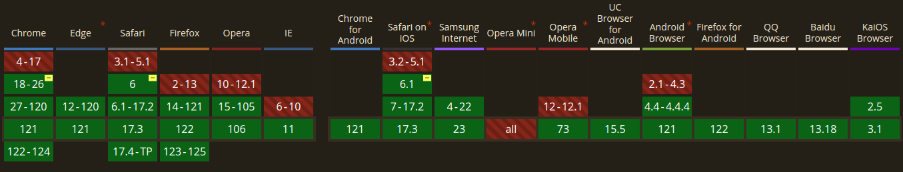

# Mutation Observer API

Mutation Observer watch for changes being made to the DOM tree.far far ago we had Mutation Events .this Mutation Observer designed as a replacement for that event !

Depending on the configuration, the observer may watch a single Node in the DOM tree, or that node and some or all of its descendant nodes.

## Advantages of Mutation Observer

The MutationObserver API provides a powerful tool for building **_responsive_** web applications that need to react to changes in the DOM. It can be used to implement a wide range of features, such as **_lazy-loading content_**, **_auto-updating UI elements_**, and **_real-time data synchronization_**.

## But How ?

the first thing we must do is make an instance :
`const observer = new MutationObserver(callback)`

this instance has thee methods just look at theme we talk about theme later :

- `observer.observe()` : it take two arguments `targetNode, config` to begin receiving notifications through its callback function when DOM changes matching the given options occur.
- `observer.disconnect()`: we stop observing until next `.observe()` called!
- `observer.takeRecords()`:Removes all pending notifications from the MutationObserver's notification queue and returns them in a new Array of MutationRecord objects.

### Syntax Reference

```js
// Select the node that will be observed for mutations
const targetNode = document.getElementById('id-here')

// Options for the observer (which mutations to observe)
const config = { attributes: true, childList: true, subtree: true }

// Callback function to execute when mutations are observed
const callback = (mutationList, observer) => {
  for (const mutation of mutationList) {
    if (mutation.type === 'childList') {
      console.log('A child node has been added or removed.')
    } else if (mutation.type === 'attributes') {
      console.log(`The ${mutation.attributeName} attribute was modified.`)
    }
  }
}

// Create an observer instance linked to the callback function
const observer = new MutationObserver(callback)

// Start observing the target node for configured mutations
observer.observe(targetNode, config)

// Later, you can stop observing
observer.disconnect()
```

## Pure Example

see the app.js

## React Example

we need animate the height of a section in here a category section we have a few ways but here we do this with Mutation Observer.

- we need a ref to that element
- and then an instance of MutationObserver
- see the code both of us understand code better than my speaks :)

```js
import React, { useRef, useEffect } from 'react'
import { CategoryItems, CategoryTitles } from './'
import './style.css'

export default function Categories() {
  const containerRef = useRef(null)

  const observer = new MutationObserver(() => {
    const categoryTitles = document.getElementById('categoryTitles')
    const categoryItems = document.getElementById('categoryItems')

    if (containerRef.current && categoryTitles && categoryItems) {
      if (categoryTitles.clientHeight > categoryItems.clientHeight) {
        containerRef.current.style.height = `${categoryTitles.clientHeight}px`
      } else {
        containerRef.current.style.height = `${categoryItems.clientHeight}px`
      }
    }
  })
  useEffect(() => {
    if (containerRef.current) {
      observer.observe(containerRef.current, {
        childList: true,
        subtree: true,
      })

      //clean up
      return () => {
        observer.disconnect()
      }
    }
  }, [])

  return (
    <div className='categories' ref={containerRef}>
      <CategoryTitles />
      <CategoryItems />
    </div>
  )
}
```

```css
.categories {
  transition: height 0.2s ease-in-out;
}
```

## Can I Use Mutation Observer?


